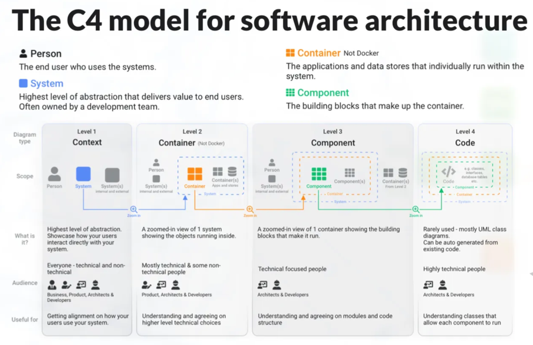

## C4 Models

### Introduction

The C4 model is a framework for visualizing and documenting software architecture. It was created by Simon Brown and
focuses on simplifying the communication of software designs by using a hierarchical, structured approach with four
levels of abstraction. The name "C4" refers to the four levels it defines: Context, Container, Component, and Code.
Here’s an overview of each level:



1. **Context Diagram**

   Purpose: Provides a high-level view of the system and its environment.
   Audience: Non-technical stakeholders (e.g., business teams, managers).
   Focus: Shows how the system interacts with external entities, such as users, external systems, and third-party
   services.
   Details:
   The system under consideration is represented as a single box.
   External entities (e.g., users, systems) and their relationships with the system are shown.
   Key Question: "What does the system do, and who/what interacts with it?"


2. **Container Diagram**

   Purpose: Illustrates the major building blocks (containers) of the system.
   Audience: Technical and development teams.
   Focus: Highlights the system's internal structure, showing containers such as web applications, databases, APIs, and
   services.
   Details:
   Each container represents a deployable or runnable unit (e.g., microservices, databases, web applications).
   Communication paths between containers are depicted.
   Key Question: "What is the system made up of, and how do these parts communicate?"


3. **Component Diagram**

   Purpose: Zooms in on a specific container to show its internal components.
   Audience: Developers and architects.
   Focus: Describes the main responsibilities of components within a container and their interactions.
   Details:
   Components are logical groupings of code or functionality (e.g., services, controllers, repositories).
   Helps identify how responsibilities are distributed within a container.
   Key Question: "How is this container implemented?"


4. **Code (or Class) Diagram**

   Purpose: Provides a detailed view of a specific component.
   Audience: Developers.
   Focus: Offers the lowest level of detail, typically showing classes, interfaces, and code relationships.
   Details: Often uses UML or similar notations to represent the relationships between classes.
   This level is optional and is typically used for documentation or complex systems.
   Key Question: "How is this component implemented in the code?"

### Benefits of C4 Models:

Clarity: Each level addresses a specific audience and use case, ensuring that stakeholders receive the right amount
of detail.
Scalability: Works well for small systems and complex architectures.
Collaboration: Encourages consistent communication across teams.
C4 models allow teams to document and visualize systems at varying levels of abstraction, aiding understanding and
collaboration among technical and non-technical audiences.

---

### Tools

- [PlantUML](https://www.plantuml.com/plantuml/uml/)
- [Structurizr](https://structurizr.com/)

_Plugin PlantUMl available for VsCode and Intellij_

---

### To Run locally

To run locally is required install Graphviz.

```bash
 sudo apt-get install graphviz openjdk-17-jre 
 ```

The diagrams were created using intellig plugin but also can be done remote by
http://www.plantuml.com/plantuml/uml/.

---

### References

1. https://c4model.com
2. https://www.youtube.com/watch?v=x2-rSnhpw0g
3. https://icepanel.medium.com/visualizing-software-architecture-with-the-c4-model-9255025c70b2
4. https://zup.com.br/blog/c4-model
5. https://medium.com/news-uk-technology/c4-model-a-better-way-to-visualise-software-architecture-df41e5ac57b8
6. https://www.youtube.com/watch?v=aJZPKyElP6A
